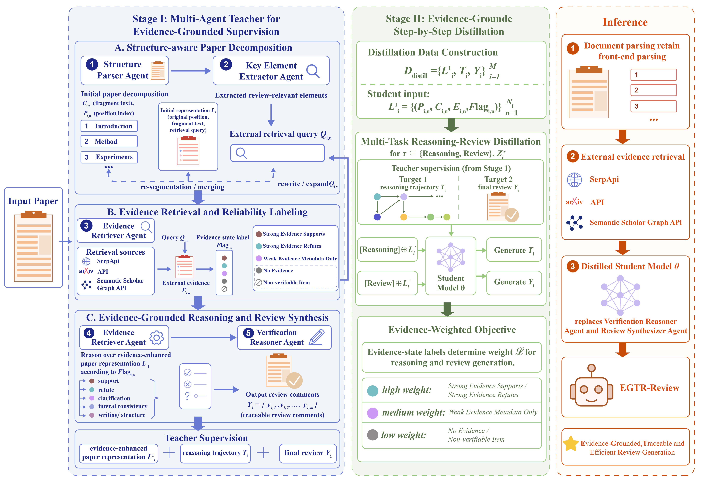

# EGTR-Review: Efficient Evidence-Grounded Scientific Peer Review Generation via Multi-Agent Teacher Distillation

> Anonymous code repository for double-blind review. Identifying information has been removed. The repository provides code, prompts, configurations, sample data, data construction scripts, and reproduction utilities. Full release will follow the licensing constraints of the original data sources.

<p align="center">
  
</p>

## Overview

**EGTR-Review** is an evidence-grounded and traceable distillation framework for automated scientific peer review generation. It uses a multi-agent teacher system to construct evidence-enhanced supervision and distills the teacher-side reasoning and review synthesis capabilities into a lightweight student model.

The framework is designed to preserve four key properties:

- **Evidence-groundedness**: review judgments are grounded in the target paper and external scholarly evidence, including evidence retrieved from SerpApi, arXiv, and Semantic Scholar.
- **Traceability**: review comments are linked to specific paper locations, such as sections, paragraphs, figures, tables, formulas, or experimental settings.
- **Pertinency**: generated comments focus on paper-specific methodology, experimental design, results, and limitations, rather than generic feedback.
- **Efficiency**: the student model replaces costly teacher-side verification reasoning and review synthesis during inference, while retaining evidence-enhanced inputs.

## Repository Structure

```text
EGTR-Review/
├── src/agents/             # Five specialized agents in the Multi-Agent Teacher
├── src/distillation/       # Distillation data construction and student training
├── configs/                # YAML configs for teacher, student, and retrieval settings
├── scripts/                # Scripts for data construction, training, inference, and reproduction
├── data/samples/           # Small sample data for inspection and testing
└── docs/                   # Prompt templates, data formats, and reproduction details
```

## Installation

```bash
git clone <anonymous_repo_url>
cd EGTR-Review

conda create -n egtr python=3.10 -y
conda activate egtr

pip install -r requirements.txt

cp .env.example .env
```

Edit `.env` and add the required API keys or API-related settings:

```bash
OPENAI_API_KEY=your_openai_key
SERPAPI_API_KEY=your_serpapi_key
S2_API_KEY=your_semantic_scholar_key_optional

# arXiv API does not require authentication by default.
# If your local implementation uses an arXiv-related environment variable, set it here.
# ARXIV_API_KEY=your_arxiv_key_optional
```

**Hardware.** Training requires A100-class GPUs; inference depends on batch size and sequence length.

## Usage Overview

The repository follows the main EGTR-Review workflow described in the paper. Detailed commands and reproduction settings are provided in `docs/reproduction.md`.

### Step 1: Run the Multi-Agent Teacher Pipeline

Run the teacher pipeline to construct the evidence-enhanced representation `L'_i`, reasoning trajectory `T_i`, and final review `Y_i` for each paper.

The pipeline invokes five role-specialized agents in `src/agents/`:

1. `structure_parser.py`: segments papers into position-indexed units, including `P_i,n` and `C_i,n`.
2. `key_element_extractor.py`: extracts review-relevant elements and generates retrieval queries `Q_i,n`.
3. `evidence_retriever.py`: retrieves external scholarly evidence and assigns evidence-state labels `E_i,n` and `Flag_i,n`.
4. `verification_reasoner.py`: performs flag-conditioned verification reasoning.
5. `review_synthesizer.py`: filters, merges, and ranks candidate review comments into the final review.

### Step 2: Build the Distillation Dataset

Convert teacher outputs into the distillation dataset `D_distill`, where each instance contains the evidence-enhanced input, teacher-side reasoning trajectory, and final review.

A per-paper JSONL instance follows the schema below:

```json
{
  "paper_id": "iclr2019_1234",
  "L_prime": [
    {
      "P": "Section 4.2, Paragraph 3",
      "C": "paper fragment",
      "E": "retrieved evidence",
      "Flag": "[Strong Evidence-Supports]"
    }
  ],
  "T": "<teacher-side reasoning trajectory>",
  "Y": "<final review comments>"
}
```

### Step 3: Train the Student Model

Train the student model on `D_distill` with task-prefix-driven multi-task learning. The student model is initialized from **Qwen2.5-7B-Instruct**.

- `Reasoning` prefix: the model learns to generate the teacher-side reasoning trajectory `T_i`.
- `Review` prefix: the model learns to generate the final review `Y_i`.

The training objective uses evidence-weighted loss, where sample weights `α_i` are aggregated from evidence-state labels `Flag_i,n`. The balance coefficient `λ` controls the trade-off between reasoning supervision and review supervision.

Detailed hyperparameters are specified in `configs/student_train.yaml`.

### Step 4: Run Inference

Run inference on evaluation or user-provided papers. The expected output is a structured review file containing paper positions, evidence, reasoning traces, and final comments.

### Step 5: Evaluate

Evaluate generated reviews using the metrics and analysis protocols described in the paper and appendix. Detailed metric definitions, prompts, and reproduction instructions are provided in the `docs/` directory.

## Data

The experimental corpus is constructed from PeerRead and OpenReview, focusing on public ICLR submissions from 2017 to 2020. The split used in the paper is:

- Training: 997 papers
- Validation: 60 papers
- Test: 329 papers

The anonymous repository includes only small samples under `data/samples/` for inspection and testing. The full benchmark is reconstructed from official data sources through the provided scripts.

The data construction process removes samples with missing paper text, missing reviews, duplicate records, or unmatched paper-review pairs. All splits are performed at the paper level. Human reviews, author responses, decisions, ratings, and confidence scores are excluded from teacher-side evidence retrieval and student training to reduce leakage risks.

See `data/data_card.md` for the data card and additional preprocessing details.

## Configuration Files

The `configs/` directory stores reproducible settings for the main components:

```text
configs/
├── teacher_pipeline.yaml       # Multi-Agent Teacher settings
├── retrieval.yaml              # External retrieval and evidence-labeling settings
├── student_train.yaml          # Student-model training hyperparameters
├── student_inference.yaml      # Student inference settings
└── evaluation.yaml             # Evaluation settings
```

The configuration files are intended to make model settings, decoding parameters, retrieval options, and training hyperparameters explicit and easy to inspect.

## Documentation

The `docs/` directory contains supporting materials for reproducibility:

```text
docs/
├── prompts/                    # Prompt templates for agents and baselines
├── data_format.md              # Input, output, and distillation data formats
├── reproduction.md             # Reproduction instructions
└── leakage_control.md          # Data leakage filtering rules
```

Prompt templates cover the Multi-Agent Teacher, baseline methods, review synthesis, LLM-as-Judge evaluation, and evidence-related checks.

## Ethical and Leakage Control

EGTR-Review is designed to assist human reviewers by providing evidence-based and traceable preliminary feedback. It is not intended to replace expert judgment in formal academic decision-making.

The repository includes leakage-control utilities and documentation. In particular, the evidence retrieval stage filters OpenReview review texts, author rebuttals, acceptance or rejection decisions, ratings, and confidence scores. The system preserves paper locations, evidence sources, and evidence-state labels so that generated comments can be inspected and traced.

When evidence is weak or unavailable, EGTR-Review is designed to avoid unsupported factual claims and instead generate cautious clarification questions or paper-internal validity checks.
